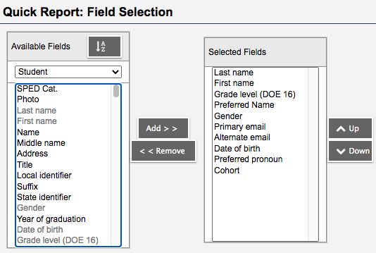

# allfamilies

The [`allfamilies.py`](./src/allfamilies.py) [Python](https://docs.python.org/3/) script parses a family .CSV file as saved from *PSB [Aspen](https://ma-brookline.myfollett.com/aspen/) > Students > Reports > Student Contacts - Parent Guardian Only* &mdash; selecting All & CSV. 

The `test-all-families.csv` file is in a specific format as defined by *PSB [Aspen](https://ma-brookline.myfollett.com/aspen/)*. The `test-class.csv` file(s) (if present on the command line) can be any *PSB [Aspen](https://ma-brookline.myfollett.com/aspen/)* class report with the following criteria:

- The first entry (index 0) is `LastName`
- The second entry (index 1) is `FirstName`
- The fourth entry (index 3) is `PreferredName` or empty
- The student's `brooklinek12.org` e-mail address appears somewhere in the record as the first entry with an '`@`'.
- The combination of the `LastName` &amp; `FirstName` fields in `test-class.csv` must match the key `"<LastName>, <FirstName>"` following `Name` in the student record in `test-all-families.csv`.

Note: My typical [Aspen](https://ma-brookline.myfollett.com/aspen/) class report .CSV file uses the following fields:

```
LastName,FirstName,Grade,Preferred,Gender,Email1,Email2,DOB,Pref pronoun,Cohort	
```


Sample formats for each .CSV file are...

[`test-all-families.csv`](./data/test-all-families.csv):

```csv
,,,Brookline Public Schools,,,,,Student Contacts,,Brookline High School,,,,,,,
,,,Page 1,,,,,,,,,,42690,,,,
,Name,"Aardvark, Student",,333 Washington St,,"Brookline, MA 02445",,,,,,,,,,Homeroom,UA
Name,,,,,Relationship,,Home Phone,,Work Phone,,Cell Phone,,,,Email Address,,
"Aardvark, Mother",,,,,Mother,,666-555-4444,,555-555-5555,,,,,mother@psb.email,,,
"Aardvark, Father",,,,,Father,,666-555-4444,,,,,444-555-6666,,father@psb.email,,,
```

[`test-class.csv`](./data/test-class.csv):

```csv
Aardvark,Student,6,Arthur,M,26aardvarka@brooklinek12.org,arthur@pbs.org,4/7/08,M,,,,,,,
```

Sample output from `allfamilies.py` is:

<span style="color:red;">`dcp:~/work/Python/allfamilies$`</span>
<span style="color:green;">`python3 src/allfamilies.py data/test-all-families.csv data/test-class.csv -ps`</span>

```
############################ test-class.csv ############################
"Aardvark, Arthur" <26aardvarka@brooklinek12.org>, 
"Aardvark, Mother" <mother@psb.email>, 
"Aardvark, Father" <father@psb.email>, 
```

## Command-line options

<span style="color:red;">`dcp:~/work/Python/allfamilies$`</span>
<span style="color:green;">`python3 src/allfamilies.py -?`</span>

```
usage: allfamilies.py [-?] [--version] [-p] [-r] [-t] [-s] [-v]
                      PATH [CSV [CSV ...]]

Parse family .CSV file as saved from PSB Aspen > Students > Reports > Student
Contacts - Parent Guardian Only - selecting All & CSV. (If student .CSV files
are present, only include families of students in those files.)

positional arguments:
  PATH             path to family .CSV file
  CSV              path to student .CSV file(s) (default: None)

optional arguments:
  -?, --help       show this help message and exit
  --version        show program's version number and exit
  -p, --print      print family e-mail addresses (default: False)
  -r, --relation   include relationship in e-mail addresses (default: False)
  -t, --telephone  include telephone in e-mail addresses (default: False)
  -s, --student    include student e-mail address if possible (default: False)
  -v, --verbose    echo status information (default: False)
  ```

<hr>

[&#128279; permalink](https://psb-david-petty.github.io/allfamilies) and [&#128297; repository](https://github.com/psb-david-petty/allfamilies) for this page.
